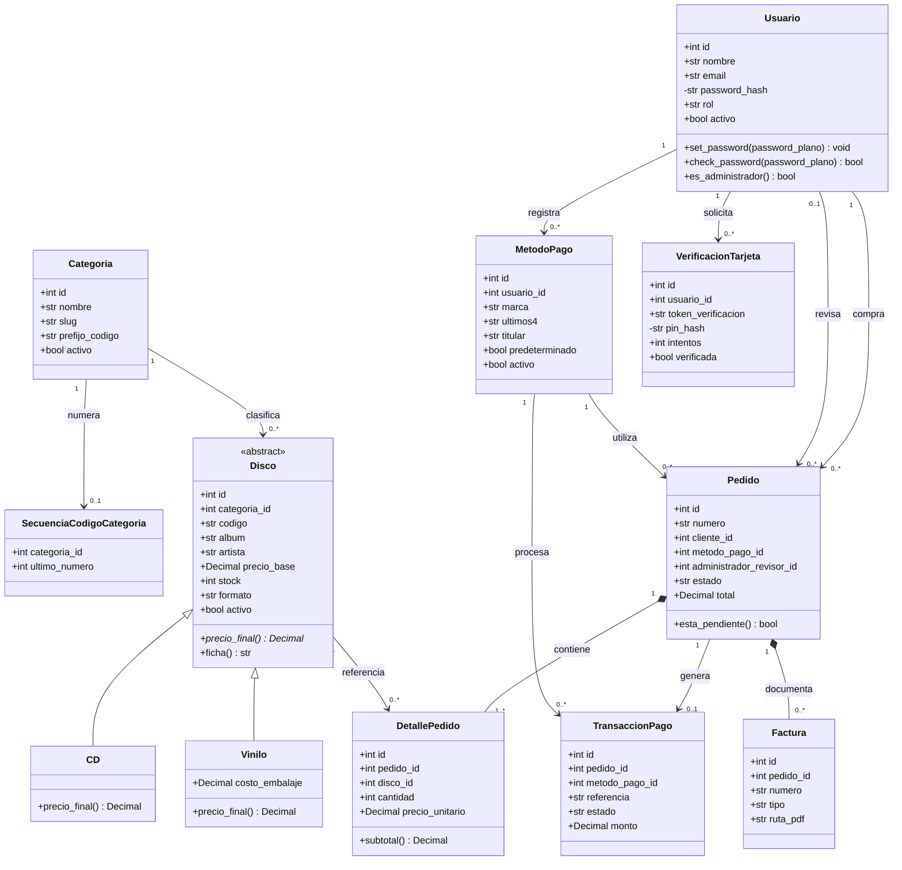

# Diagrama UML de clases de New Records

El diagrama representa las entidades persistentes, sus operaciones principales, las asociaciones y la herencia polimórfica de los formatos físicos.

## Decisiones POO

- `Disco` es una clase padre persistente y abstracta: define el contrato `precio_final()` y concentra los datos comunes del producto físico.
- `CD` y `Vinilo` implementan el mismo contrato con reglas distintas. El consumidor no pregunta por el formato para calcular el precio.
- SQLAlchemy implementa la jerarquía mediante herencia de tabla única y utiliza `Disco.formato` como discriminador.
- La contraseña y el PIN se almacenan como hashes; la comparación se realiza mediante métodos y no exponiendo los valores persistidos.
- Los servicios de aplicación coordinan transacciones completas, mientras que las entidades conservan comportamiento propio del dominio.
