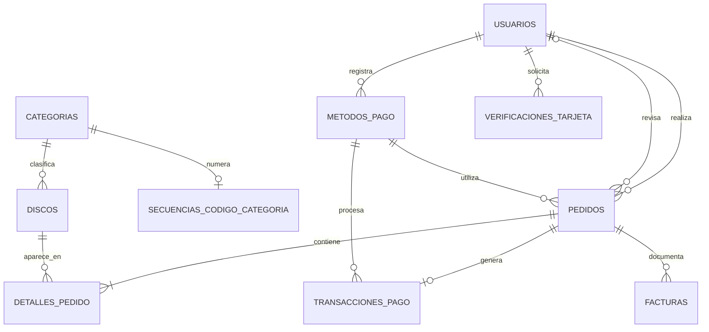

# Modelo entidad-relación de New Records

## Alcance

El modelo cubre catálogo, usuarios, verificación de tarjetas, pedidos, cobros simulados y documentos PDF. El carrito no utiliza una tabla porque permanecerá temporalmente en la sesión Flask hasta que el cliente confirme el checkout.

## Diagrama

## Herencia POO de discos

`Disco` es la clase padre persistente y abstracta para SQLAlchemy. `CD` y `Vinilo` son sus únicas clases concretas.

La estrategia es herencia de tabla única:

- Todos los formatos se almacenan en `discos`.
- La columna `formato` funciona como discriminador.
- Los valores permitidos son `CD` y `VINILO`.
- Al consultar `Disco`, SQLAlchemy crea automáticamente un objeto `CD` o `Vinilo`.
- Cada clase concreta sobrescribe `precio_final()` para aplicar su propia regla física de envío y embalaje.

No existen productos digitales, perecibles ni clases provenientes del ejemplo de tienda genérica.

## Decisiones relacionales

- Una categoría puede clasificar muchos discos, pero cada disco pertenece a una categoría.
- Cada categoría mantiene como máximo una secuencia transaccional para generar códigos únicos.
- Un usuario puede registrar varios métodos de pago y realizar varios pedidos.
- `Pedido` tiene dos relaciones diferentes con `Usuario`: cliente y administrador revisor.
- Cada pedido conserva sus líneas en `detalles_pedido`.
- El detalle conserva álbum, artista, formato y precio unitario históricos, aunque el disco cambie posteriormente.
- Un pedido admite una transacción simulada principal.
- Un pedido puede tener un comprobante pendiente y una factura final.
- Las FK históricas utilizan eliminación restrictiva; la aplicación deberá desactivar usuarios, categorías y discos en lugar de borrarlos.

## Estados controlados

- Usuario: `cliente` o `administrador`.
- Disco: `CD` o `VINILO`.
- Pedido: `PENDIENTE`, `APROBADO` o `RECHAZADO`.
- Transacción: `PENDIENTE`, `APROBADA` o `RECHAZADA`.
- Factura: `COMPROBANTE_PENDIENTE` o `FACTURA_FINAL`.
